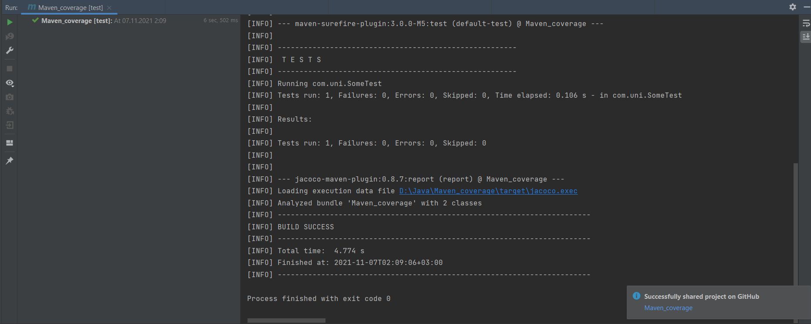

# Maven_coverage
## Помощь с покрытием в Sonarcloud в проекте с Maven

## pom.xml
в properties закидываем
```xml
        <project.build.sourceEncoding>UTF-8</project.build.sourceEncoding>

        <maven.compiler.source>16</maven.compiler.source>
        <maven.compiler.target>16</maven.compiler.target>
```

В моём проектe SDK 16 поэтому указал 16

я указывал Junit5 при создании тестов, поэтому закидываем в dependencies вот это
```xml
        <dependency>
            <groupId>org.junit.jupiter</groupId>
            <artifactId>junit-jupiter</artifactId>
            <version>5.8.1</version>
            <scope>test</scope>
        </dependency>
        <dependency>
            <groupId>org.junit.jupiter</groupId>
            <artifactId>junit-jupiter-engine</artifactId>
            <version>5.8.1</version>
            <scope>test</scope>
        </dependency>
        <!-- https://mvnrepository.com/artifact/org.jacoco/jacoco-maven-plugin -->
        <dependency>
            <groupId>org.jacoco</groupId>
            <artifactId>jacoco-maven-plugin</artifactId>
            <version>0.8.7</version>
            <scope>test</scope>
        </dependency>
```

ещё закидываем в pom.xml вот это
```xml
    <build>
        <plugins>
            <plugin>
                <groupId>org.apache.maven.plugins</groupId>
                <artifactId>maven-surefire-plugin</artifactId>
                <!-- JUnit 5 requires Surefire version 2.22.0 or higher -->
                <version>3.0.0-M5</version>
            </plugin>

            <plugin>
                <groupId>org.jacoco</groupId>
                <artifactId>jacoco-maven-plugin</artifactId>
                <version>0.8.7</version>
                <executions>
                    <execution>
                        <goals>
                            <goal>prepare-agent</goal>
                        </goals>
                    </execution>
                    <execution>
                        <id>report</id>
                        <phase>test</phase>
                        <goals>
                            <goal>report</goal>
                        </goals>
                    </execution>
                    <execution>
                        <id>jacoco-check</id>
                        <goals>
                            <goal>check</goal>
                        </goals>
                        <configuration>
                            <rules>
                                <rule>
                                    <element>PACKAGE</element>
                                    <limits>
                                        <limit>
                                            <counter>LINE</counter>
                                            <value>COVEREDRATIO</value>
                                            <minimum>0.0</minimum>
                                        </limit>
                                    </limits>
                                </rule>
                            </rules>
                        </configuration>
                    </execution>
                </executions>
            </plugin>

            <plugin>
                <groupId>org.apache.maven.plugins</groupId>
                <artifactId>maven-compiler-plugin</artifactId>
                <version>3.8.1</version>
                <configuration>
                    <debug>false</debug>
                    <optimize>true</optimize>
                    <source>16</source>
                    <target>16</target>
                </configuration>
            </plugin>
        </plugins>
    </build>
```

Опять же в моём проектe SDK 16 поэтому указал 16
```xml
        <source>16</source>
        <target>16</target>
```


теперь можно проверить, запустив справа во вкладке maven lifecycle/test
В консоли должно быть что-то такое

В папке target должен появиться jacoco.exec
В папке target/site/jacoco/ можно посмотреть отчёт о покрытии и, если были созданы тесты, должно показывать ненулевое покрытие

# SonarCloud
## pom.xml
добавить в properties
```xml
        <!-- Sonar -->
        <sonar.organization>universityteam</sonar.organization>
        <sonar.host.url>https://sonarcloud.io</sonar.host.url>
        <sonar.java.coveragePlugin>jacoco</sonar.java.coveragePlugin>
        <sonar.dynamicAnalysis>reuseReports</sonar.dynamicAnalysis>
        <sonar.jacoco.reportPath>${project.basedir}/../target/jacoco.exec</sonar.jacoco.reportPath>
        <sonar.language>java</sonar.language>
```
Эту строку нужно изменить под свой проект
```xml
        <sonar.organization>universityteam</sonar.organization>
```


## .github/workflows/build.yml
Далее подключаем репозиторий к SonarCloud

были изменены строки, в отличие от дефолтного файла, создаваемого при подключении к SonarCloud
было
```yml
      - name: Set up JDK 11
        uses: actions/setup-java@v1
        with:
          java-version: 11
```
стало
```yml
      - name: Set up JDK 16
        uses: actions/setup-java@v1
        with:
          java-version: 16
```

